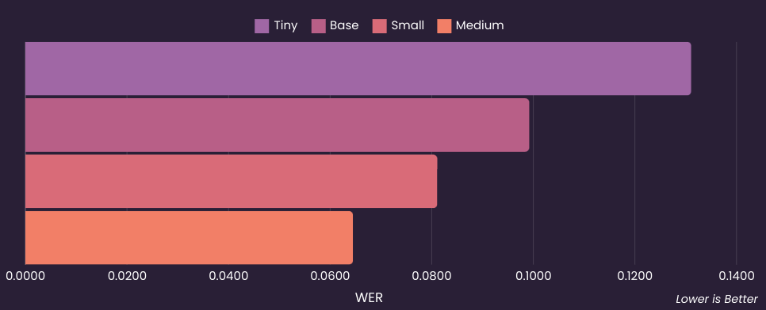

# Whisper Tune

<div align="center">

      

</div>

Fine-tune [__OpenAI’s Whisper model__](https://cdn.openai.com/papers/whisper.pdf) for automatic speech recognition (ASR) on custom datasets. This script supports flexible parameterization, model saving, and experiment tracking. 

<div align="center">


</div>

## Requirements

To install the required dependencies, you can use the following command:

```bash
pip install -r requirements.txt
```

## Environment Variables

Ensure you have a `.env` file in the project root that contains your [__Comet ML__](https://www.comet.com/) API key for logging:

```
COMET_API_KEY = "your_comet_api_key"
```

The model training logs will be pushed to Comet ML for tracking the experiments.

## Usage

### Collect your own dataset

You can use the [__Mimic Recording Studio__](https://github.com/MycroftAI/mimic-recording-studio) to collect your own dataset.

### 1. Downsample

Downsample the audio files to 16Khz sample rate and change format to FLAC.

```bash
python downsample.py \
    --input_file <mimic-audio/backend/path/to/transcript.txt> \ 
    --output_dir <output/directory> \
    --percent 20
```

### 2. Merge

Merge train and test JSON files into a single file.

```bash
python merge.py \
    <path/to/train_1.json> <path/to/train_2.json> <path/to/train_3.json> \
    --output merged_train.json
```


| Argument                        | Description                                                                                       | Default Value   |
|----------------------------------|---------------------------------------------------------------------------------------------------|-----------------|
| `--train_json`                   | Path to the training dataset in JSON format.                                                      | N/A             |
| `--test_json`                    | Path to the test dataset in JSON format.                                                          | N/A             |
| `--whisper_model`, `-model`                | Choose from `tiny`, `base`, `small`, `medium`, `large`, `large-v2`, `large-v3`, `large-v3-turbo`, or provide a custom Whisper model name. | `base`             |
| `--batch_size`                   | The batch size for training and evaluation.                                                       | `16`             |
| `--gradient_accumulation_steps`, `-grad_steps`   | Number of gradient accumulation steps.                                                            | `1`             | 
| `--learning_rate`, `-lr`         | Learning rate for training.    | `2e-5`  |
| `--warmup_steps`                 | Number of warmup steps for the learning rate scheduler.                                            | `500`           |
| `--epochs`, `-e`                       | Number of epochs to train for.                                                                    | `10`            |
| `--num_workers`, `-w`            | Number of CPU workers.                                                                            | `2` |

```bash
python train.py \
    --train_json merged_train.json \
    --test_json merged_test.json \
    --whisper_model tiny \
    --batch_size 8 \
    --grad_steps 1 \
    --lr 1e-4 \
    --warmup_steps 75 \
    --epochs 10
    -w 2
```

## Results & Tracking 

_Training logs_, _loss curves_, and _WER_ can be tracked on __Comet ML__ and __TensorBoard__.

| **Model Name**    | **Parameters** | **Eval Loss** | **WER** | **Epochs** | **Batch Size** | **Learning Rate** | **Link** |
|-------------------|----------------|---------------|---------|------------|----------------|--------------------|------------------------|
| **Whisper Tiny**       | 39 M             | 0.3751        | 0.1311  | 10         | 4              | 1e-4               | [🤗](https://huggingface.co/luluw/whisper-tiny)  |
| **Whisper Base**       | 74 M             | 0.2331        | 0.0992  | 10         | 16             | 2e-05              | [🤗](https://huggingface.co/luluw/whisper-base)  |
| **Whisper Small**      | 224 M            | 0.1889        | 0.0811  | 10         | 16             | 2e-05              | [🤗](https://huggingface.co/luluw/whisper-small) |
| **Whisper Medium**     | 769 M            | 0.1404        | 0.0645  | 5          | 8              | 2e-05              | [🤗](https://huggingface.co/luluw/whisper-medium) |





## Pushing to Hugging Face Hub 🤗

The script is designed to __automatically push the best trained model to the Hugging Face Hub__. Make sure you have set up your Hugging Face credentials properly.

## License

This project is licensed under the MIT License. See the [LICENSE](LICENSE) file for details.

<!-- ## Contributions

Contributions, issues, and feature requests are welcome. Feel free to open a PR or an issue. -->